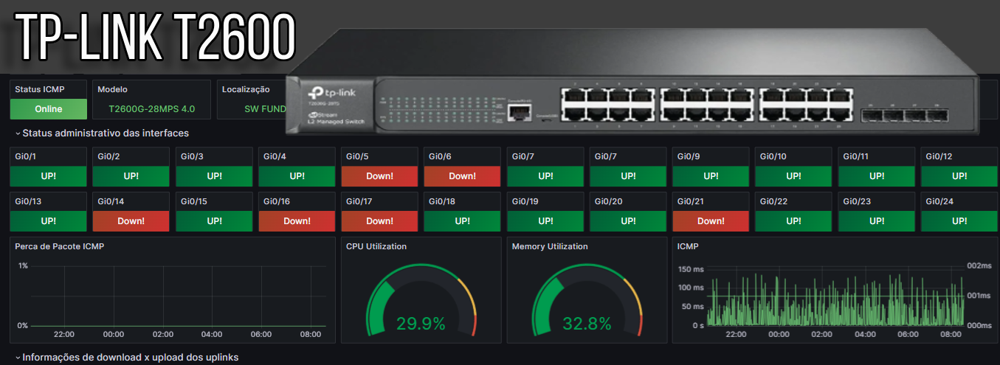

# dashboard_tplink_t2600
Dashboard para monitoramento Switch Tp-Link t2600 24p PoE

Data Soure Zabbix = alexanderzobnin-zabbix-datasource

Monitoramento: CPU - Memória RAM - ICMP (Ping, Time, Loss) - Portas Ativas e Desativadas - Informações - Bandwith Upload - Bandwith Download

Grafana Labs: https://grafana.com/orgs/marcusronney
